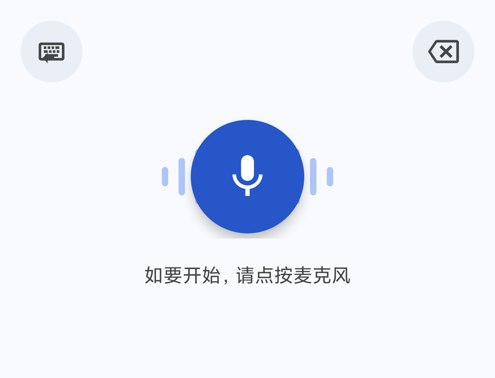

# Fcitx5 SenseVoice

[English](README.md) | [简体中文](README.zh-CN.md)

## Closed testing（Alpha）

[](https://play.google.com/apps/testing/com.fcitx5sensevoice)

| 加入方式 | 链接 |
|---|---|
| **网页加入** | https://play.google.com/apps/testing/com.fcitx5sensevoice |
| **Android 加入** | https://play.google.com/store/apps/details?id=com.fcitx5sensevoice |

> 需先在 Play Console **Closed testing → Alpha → Testers** 中添加 Google 账号；仅支持 `arm64-v8a` 设备。

基于 sherpa-onnx、Silero VAD 和 SenseVoice 的 Android 纯离线中文语音输入法。

本项目**不是 Fcitx5 插件**，也不会修改 Fcitx5 Android。它是一个独立的标准 Android `InputMethodService`；Fcitx5 通过 `android:imeSubtypeMode="voice"` 发现它，并可通过语音输入按钮切换到本输入法。

> [!IMPORTANT]
> 本项目是非官方项目，与 Fcitx、SenseVoice、FunASR、Google、Android、Linux 及其所有者无隶属或关联关系。仓库中的原创源码使用 Apache-2.0 许可证，但下载的运行时与模型权重仍受各自条款约束。在完成[二进制发布检查清单](docs/release-checklist.md#public-apk-or-app-store-release)前，请勿重新分发生成的 APK。



## 架构

```text
Fcitx5 / Android 输入法切换器
        ↓
VoiceInputMethodService（主线程：生命周期、界面、InputConnection）
        ├── PcmAudioRecorder（独立 AudioRecord 线程）
        └── SenseVoiceEngine（单一 ASR 执行器：Silero VAD + 离线解码）
                ↓
        sherpa-onnx v1.13.6 + Silero VAD + SenseVoice INT8
                ↓
        每个完整语音片段通过 InputConnection.commitText() 提交
```

- 音频：16 kHz、单声道、有符号 PCM16，最长录音 30 秒。
- 识别：每 512 个采样点计算一次 Silero VAD 概率，由本地端点状态机切分语音，再对每个完整片段执行非流式 SenseVoice 解码。这是按停顿分段提交，不是模型级逐字流式结果。
- ABI：仅 `arm64-v8a`。
- Android：`minSdk 28`，`targetSdk 36`。
- 网络：APK 不申请 `android.permission.INTERNET` 权限。

生命周期和资源管理详见 [docs/architecture.md](docs/architecture.md)。

## SenseVoice 支持的语言

当前发布的上游 SenseVoiceSmall checkpoint 支持以下语音识别和语言识别能力：

| 语言 | 代码 |
|---|---|
| 普通话 | `zh` |
| 粤语 | `yue` |
| 英语 | `en` |
| 日语 | `ja` |
| 韩语 | `ko` |

上游还提供用于自动语言识别的 `auto`，以及控制选项 `nospeech`。上述五种语言描述的是已发布的基础 checkpoint；本应用当前使用的 `2025-09-09` 模型是下文说明的粤语微调权重。应用默认使用普通话 `zh`，可在启动器设置页选择 `auto`、`zh`、`yue`、`en`、`ja` 或 `ko`。Android 语音输入法 subtype 仍为 `zh_CN`，它只用于 Fcitx5 发现输入法，不限制实际识别语言。

## 环境要求

- JBR 25.0.2（Android 字节码目标仍为 JVM 17）
- Gradle Wrapper 9.5.0
- Android Gradle Plugin 9.3.2
- Android SDK Platform 36 与 Build Tools 36.0.0
- Android `arm64-v8a` 设备
- 用于安装和诊断的 ADB

请在 IntelliJ IDEA 的 Gradle JVM 和命令行构建中都使用 JBR 25.0.2。

## 准备固定版本的本地 ASR 依赖

Gradle 会在构建时从 [JitPack](https://k2-fsa.github.io/sherpa/onnx/java-api/anroid-java.html) 解析 sherpa-onnx `v1.13.6`。模型和 tokens 不提交到 Git。请先阅读[第三方条款](THIRD_PARTY_NOTICES.md)，再准备固定版本的模型文件：

```bash
./scripts/prepare-local-asr.sh
```

脚本只下载本地模型输入，并在复制到忽略目录前校验全部哈希：

| 文件 | 固定版本 | SHA-256 |
|---|---|---|
| SenseVoice 归档 | `2025-09-09 INT8` | `7305f7905bfcf77fa0b39388a313f3da35c68d971661a65475b56fb2162c8e63` |
| `model.int8.onnx` | `2025-09-09 INT8` | `12ca1a2ae7ecf3e0019ef2822307ee0b5cadc9196569e379b4c4026f8205276d` |
| `tokens.txt` | `2025-09-09` | `f449eb28dc567533d7fa59be34e2abca8784f771850c78a47fb731a31429a1dc` |
| Silero VAD | `silero_vad.onnx` | `9e2449e1087496d8d4caba907f23e0bd3f78d91fa552479bb9c23ac09cbb1fd6` |

已于 2026-08-28 核对官方上游：[`v1.13.6`](https://github.com/k2-fsa/sherpa-onnx/releases/tag/v1.13.6) 是最新 sherpa-onnx 稳定语义版本。本应用使用 sherpa-onnx 当前日期最新的标准 CPU INT8 SenseVoice 格式归档 `2025-09-09`。其中的模型是 Apache-2.0 的 [ASLP-lab WSYue-ASR `sensevoice_small_yue`](https://huggingface.co/ASLP-lab/WSYue-ASR) 粤语微调权重，并非 FunAudioLLM 原始 SenseVoiceSmall checkpoint 的新版。由于当前使用派生权重，每次更新模型后都必须对所有开放的识别语言做真机回归测试。

## 构建

```bash
export JAVA_HOME="/path/to/jbr-25.0.2"
export ANDROID_SDK_ROOT="/path/to/Android/Sdk"
export ANDROID_HOME="$ANDROID_SDK_ROOT"

./scripts/prepare-local-asr.sh
./gradlew --no-daemon test lintDebug assembleDebug assembleRelease
```

Debug APK 位于：

```text
app/build/outputs/apk/debug/app-debug.apk
```

`assembleRelease` 会生成本地未签名 Release APK。在模型与原生运行时的声明要求全部完成前，CI 不会上传 APK。

## 安装与启用

```bash
adb install -r app/build/outputs/apk/debug/app-debug.apk
adb shell ime enable com.fcitx5sensevoice/.VoiceInputMethodService
```

在启动器权限页面或系统提示中授予麦克风权限；如系统要求，再到 Android 键盘设置中启用本输入法。

## 设置

从 Android 启动器打开 **Fcitx5 SenseVoice**，可以调整：

- 识别语言：自动、普通话、粤语、英语、日语或韩语；
- 智能格式化（ITN），用于将口述数字等内容转换为书写形式；
- 三级收音灵敏度；
- 0.5、0.7、1.0 或 1.5 秒停顿结束时长；
- 查看并申请麦克风权限。

设置保存在应用私有偏好中。下次打开语音输入面板时，本地识别器会安全重建并应用新配置，全程不需要网络。

## 在 Fcitx5 中启用语音输入

1. 打开 Fcitx5 Android 设置。
2. 开启**显示语音输入按钮**。
3. 如果设置中提供首选语音输入法选项，选择 **Fcitx5 SenseVoice**。
4. 打开非密码输入框，点击 Fcitx5 的语音按钮。

语音面板支持：

- 点击麦克风开始，再次点击停止；
- 长按麦克风录音，松开停止；
- 录音时达到配置的停顿结束时长（默认约 700 ms）会结束当前语音片段并插入识别文字，随后继续监听下一段；
- 点击左上角键盘图标返回上一个输入法；Android 没有上一个输入法记录时会打开输入法选择器；
- 点击右上角退格图标删除选区或前一个字符，长按可连续删除。

## 模型安装

固定版本的 SenseVoice、tokens 和 VAD 文件作为开发 APK 的构建期 assets。首次使用时，应用先复制到私有暂存目录，校验固定 SHA-256，再原子安装并设为只读。文件缺失、损坏或哈希不符时会阻止 ASR 初始化并显示错误，不会回退到网络服务。

## 离线与隐私

- 不申请 `INTERNET` 权限。
- 不包含 HTTP、WebSocket、遥测、云端 ASR 或运行时模型下载路径。
- 音频只保存在有界内存 VAD 缓冲区和最长 30 秒的回退缓冲区中，识别后立即丢弃。
- 识别文字只提交给当前 Android `InputConnection`，日志不记录完整文本。

更多说明见[隐私政策](PRIVACY.md)。

## 已知限制

- 开发 APK 内置约 228 MiB INT8 模型，因此体积较大。
- 默认使用普通话；设置中可选择自动识别或明确指定五种语言，但识别质量取决于当前粤语微调权重。
- SenseVoice 本身仍是离线整段模型：没有逐字 partial result 或 composing text；只有 VAD 检测到语音端点后才分段提交。
- VAD 最短语音约 256 ms、预留音频约 224 ms、单段最长 15 秒仍固定；收音灵敏度和停顿结束时长可配置。若 VAD 未输出任何片段，手动停止时会对完整录音执行一次回退解码，避免已录语音丢失。
- 没有 QNN/NPU 或自定义词典。
- 只打包 `arm64-v8a`。
- 公开二进制发布仍需通过法律、签名、包检查和真机手工测试门禁。

## Google Play 发布

发布材料、商店文案和图形素材见 [`docs/google-play-listing.md`](docs/google-play-listing.md)。生成 signed AAB：

```bash
./scripts/create-upload-keystore.sh   # 首次发布前执行一次
./scripts/package-release.sh
./scripts/verify-release-package.sh   # 检查权限与 ABI
```

上传 `app/build/outputs/bundle/release/app-release.aab`。真机验收清单见 [`docs/manual-test.md`](docs/manual-test.md)。Alpha 测试链接见文首 **Closed testing（Alpha）**。

## 许可证

原创源码和文档使用 [Apache License 2.0](LICENSE)，Copyright 2026 Lingxiao Li。第三方运行时和模型不会被重新许可，详见 [`NOTICE`](NOTICE) 与 [`THIRD_PARTY_NOTICES.md`](THIRD_PARTY_NOTICES.md)。

启动器图标使用原创矢量图。产品名称与标志属于各自所有者；Apache-2.0 不授予商标权。

## 项目政策

- [贡献指南](CONTRIBUTING.md)
- [隐私政策](PRIVACY.md)
- [安全问题报告](SECURITY.md)
- [发布检查清单](docs/release-checklist.md)
